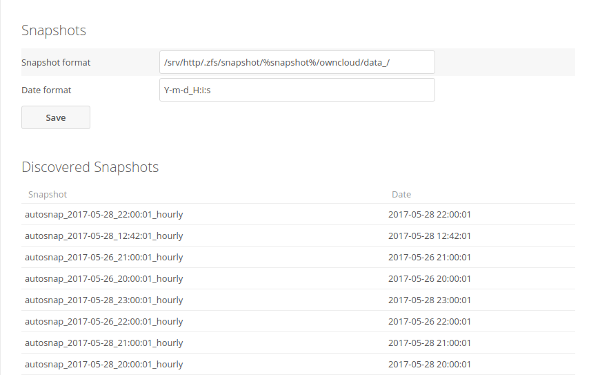

# files_snapshots

Access filesystem snapshots from Nextcloud.

Allows using filesystem snapshots (such as provided by zfs and btrfs) instead of builtin Nextcloud versions.

## Limitations

This app does not automatically create snapshots itself, because of this it might not have a snapshot
for every change made to the file.

Since no snapshots are created by the app, when reverting a file, any change made to a file since the last snapshot will be lost.

## Configuring

In order to access snapshots, two things need to be configured under the admin settings.

- snapshot format: where the snapshots of the Nextcloud data directory can be found
 
  example: `/srv/http/.zfs/snapshot/%snapshot%/nextcloud/data/`  
  where `/srv/http/nextcloud/data` is the Nextcloud data directory  
  and `/srv/http` is a folder which is being snapshoted to `/srv/http/.zfs/snapshot`.
   
- snapshot folder date format: How the snapshot date is formatted in the snapshot name

  Specifications about the format: http://php.net/manual/de/datetime.createfromformat.php
  
  Example: `Y-m-d_H:i:s` will correctly match snapshots named `autosnap_2017-05-27_00:00:01_hourly`
  
  Hint: Each * will only match until the next separator or digit, a * at the end and at beginning are added by the script automatical
  
  Example: `-*-*-Y-m-d-Hi`  will correctly match snapshots named `zfs-auto-snap_frequent-2017-06-23-1930`
